# Overview
## MiniNet
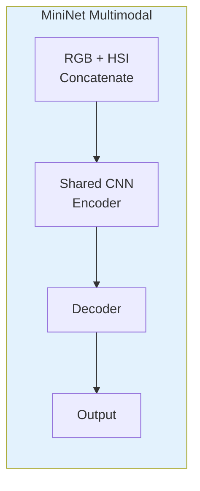
## SegFormer
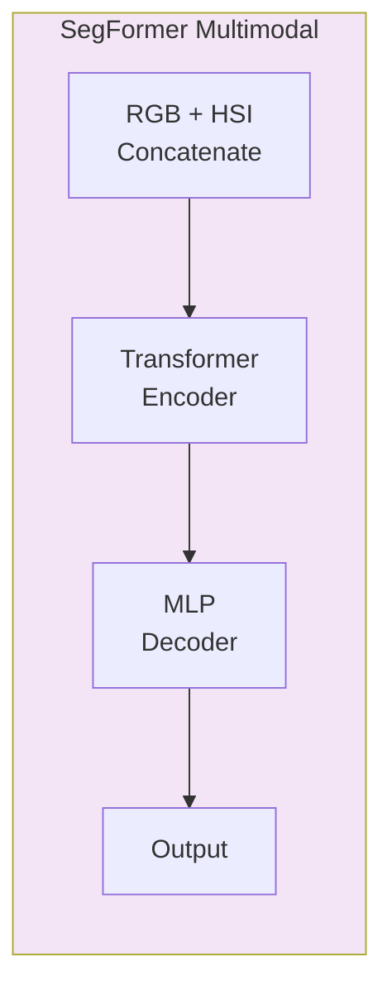
## CMX-B0
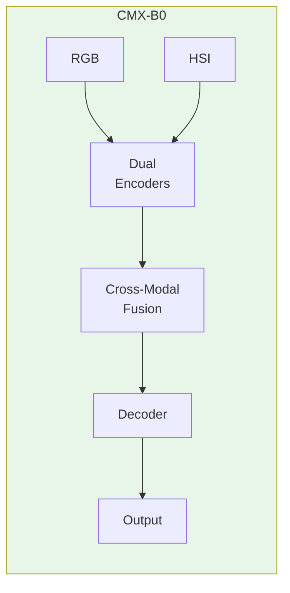
## FuseMoE
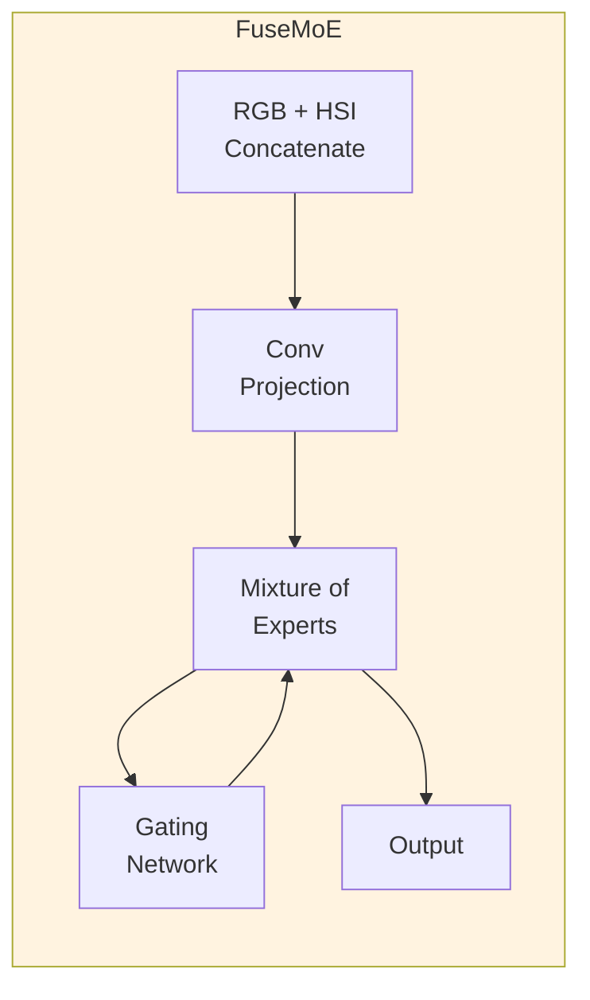

## MAE-MoE (PROPOSED)
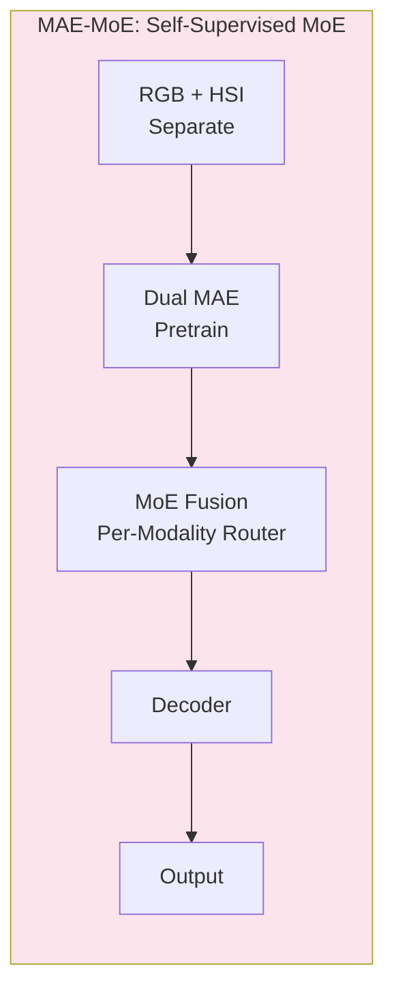

## HMoE-Seg (PROPOSED)
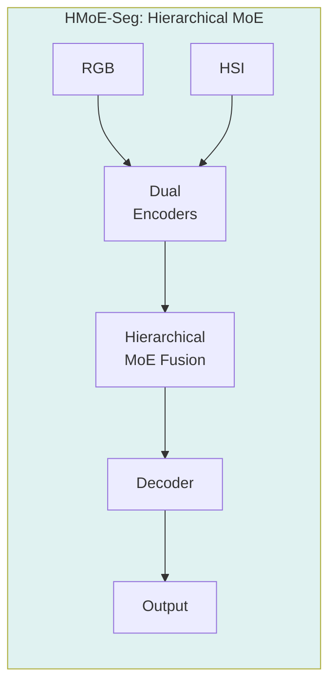

## MAE-CMX (PROPOSED)
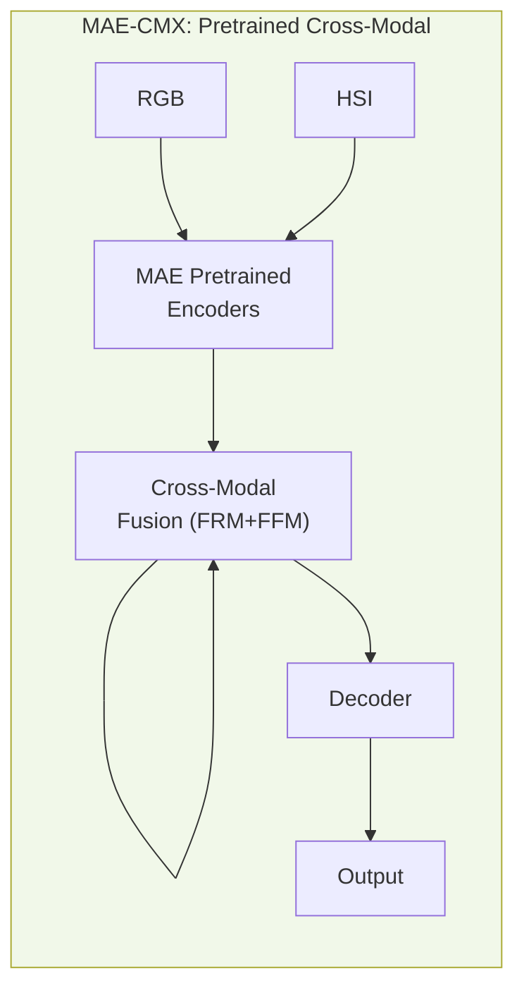

# Detail

## MiniNet
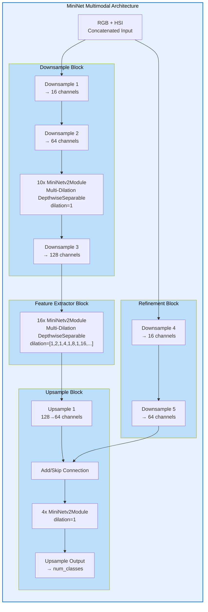

## SegFormer
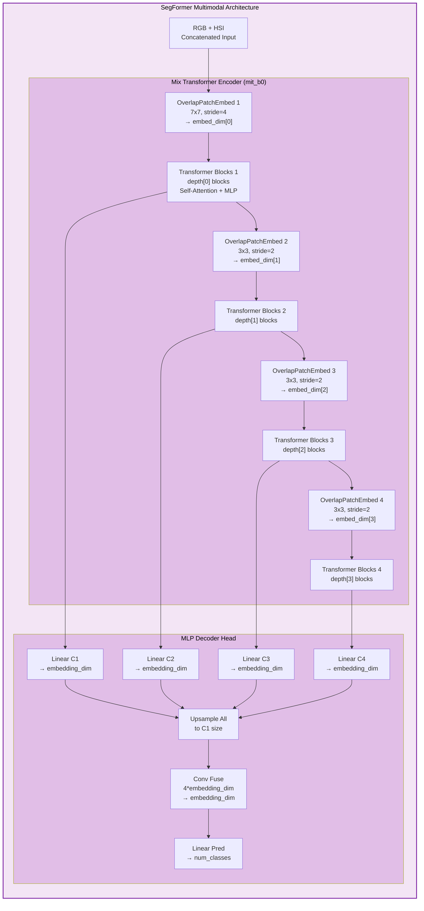

## CMX-B0
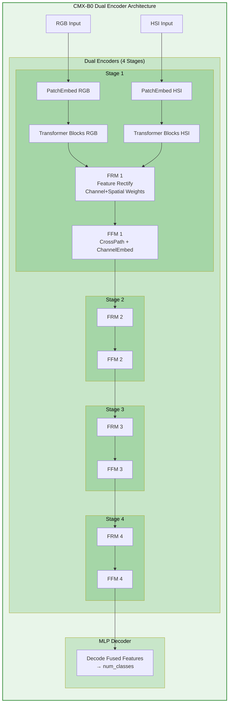

## FuseMoE
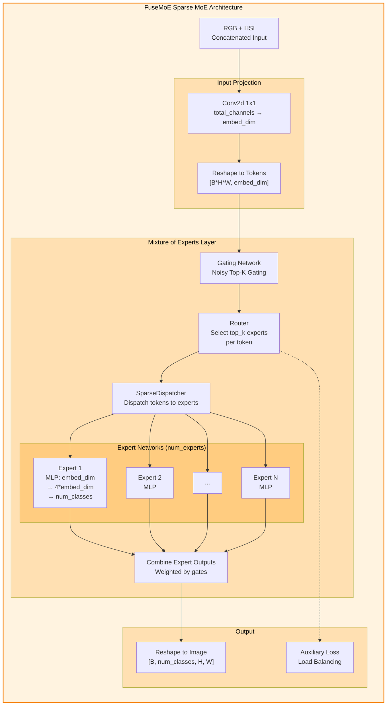

## MAE-MoE (PROPOSED)
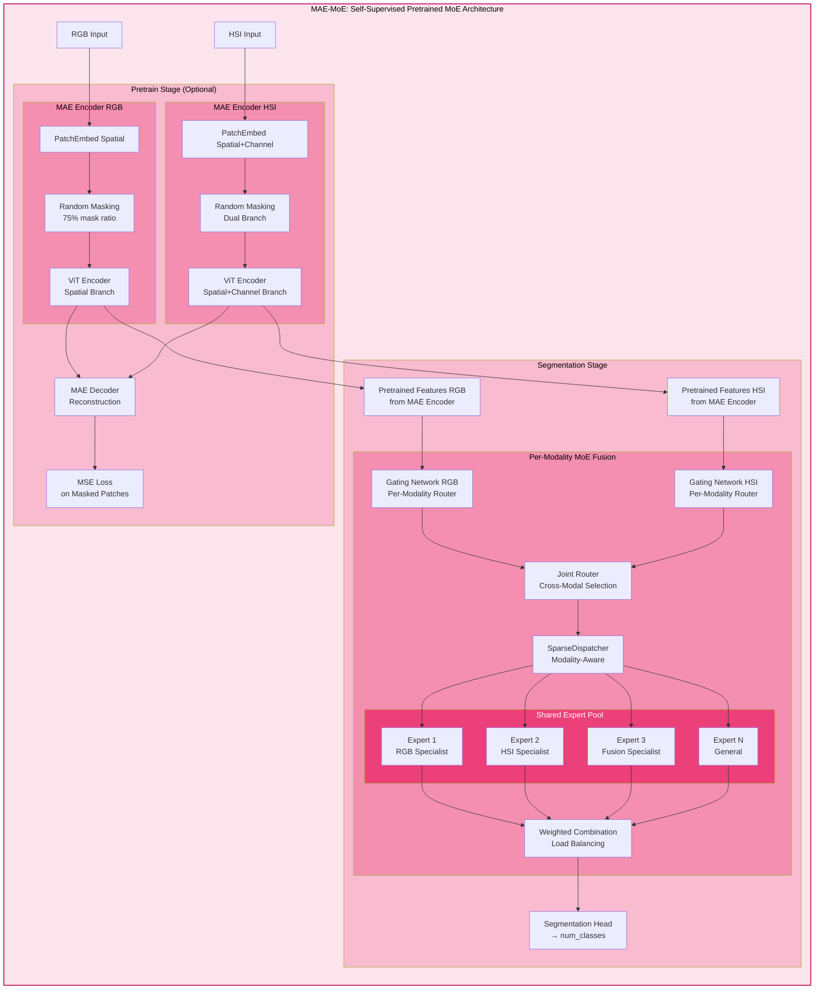

## HMoE-Seg (PROPOSED)
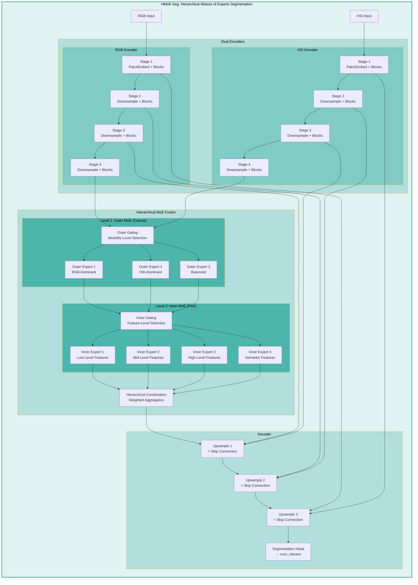

## MAE-CMX (PROPOSED)
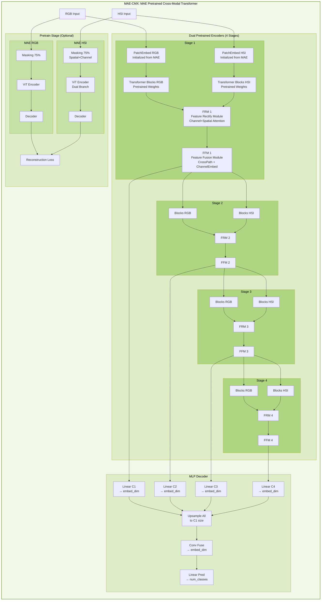

# Proposed Models Summary

## 1. MAE-MoE: Self-Supervised Pretrained Mixture of Experts
**Key Innovation**: Combines self-supervised pretraining (MAE) with adaptive expert routing (MoE)

**Advantages**:
- **Better initialization**: MAE pretraining learns robust representations from unlabeled RGB+HSI data
- **Modality-specific experts**: Per-modality router allows specialized experts for RGB vs HSI
- **Efficient inference**: Sparse activation (top-k experts) reduces computation
- **Transfer learning**: Pretrained encoder can be reused across different waste segmentation tasks

**Architecture Details**:
- Pretrain stage: Dual MAE encoders (RGB spatial + HSI spatial+channel) with 75% masking
- Segmentation stage: Per-modality MoE with joint router for cross-modal expert selection
- Expert specialization: RGB-specialist, HSI-specialist, fusion-specialist, and general experts
- Load balancing loss ensures all experts are utilized

**Best for**: Scenarios with limited labeled data but abundant unlabeled RGB+HSI pairs

---

## 2. HMoE-Seg: Hierarchical Mixture of Experts Segmentation
**Key Innovation**: Two-level hierarchical MoE for coarse-to-fine multimodal fusion

**Advantages**:
- **Hierarchical fusion**: Outer MoE selects modality-level strategy, inner MoE refines feature-level fusion
- **Multi-scale features**: Skip connections from all encoder stages to decoder
- **Adaptive fusion**: Different fusion strategies at different semantic levels
- **Interpretability**: Outer experts show which modality dominates for different regions

**Architecture Details**:
- Dual encoders: Separate RGB and HSI encoders with 4 stages each
- Outer MoE (Level 1): 3 experts for RGB-dominant, HSI-dominant, and balanced fusion
- Inner MoE (Level 2): 4 experts for low/mid/high/semantic level features
- Decoder: Progressive upsampling with skip connections from all stages

**Best for**: Complex scenes where different regions require different fusion strategies (e.g., some waste types more visible in RGB, others in HSI)

---

## 3. MAE-CMX: MAE Pretrained Cross-Modal Transformer
**Key Innovation**: Enhances CMX with MAE pretraining for better initialization

**Advantages**:
- **Strong baseline**: Builds on proven CMX architecture (FRM+FFM modules)
- **Better convergence**: MAE pretrained weights provide better starting point
- **Dual-branch MAE**: Spatial+channel masking for HSI captures spectral correlations
- **Cross-modal attention**: FRM and FFM modules explicitly model RGB-HSI interactions

**Architecture Details**:
- Pretrain: Separate MAE for RGB (spatial only) and HSI (spatial+channel dual branch)
- Encoder: 4-stage dual encoders initialized from MAE weights
- Fusion: FRM (Feature Rectify Module) + FFM (Feature Fusion Module) at each stage
- Decoder: MLP decoder with multi-scale feature aggregation

**Best for**: When you have unlabeled data for pretraining and want to leverage CMX's proven cross-modal fusion

---

## Comparison Table

| Model | Pretraining | Fusion Strategy | Complexity | Best Use Case |
|-------|-------------|-----------------|------------|---------------|
| **FuseMoE** | ❌ | Sparse MoE (joint) | Medium | Baseline MoE approach |
| **MAE-MoE** | ✅ MAE | Per-modality MoE | High | Limited labeled data |
| **HMoE-Seg** | ❌ | Hierarchical MoE | Very High | Complex scenes, interpretability |
| **MAE-CMX** | ✅ MAE | FRM+FFM (CMX) | High | Leverage CMX + pretraining |

## Implementation Priority

1. **MAE-MoE** - Most innovative, combines best of both base models
2. **MAE-CMX** - Easier to implement, builds on existing CMX
3. **HMoE-Seg** - Most complex, implement if others show MoE benefits