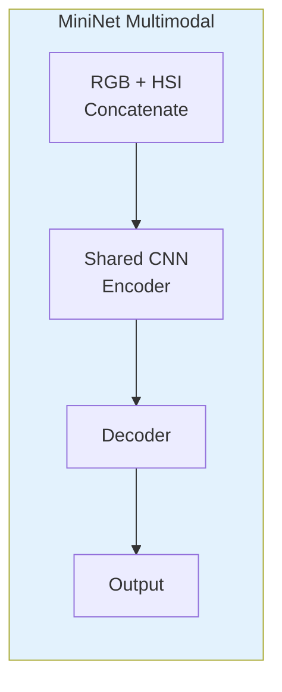
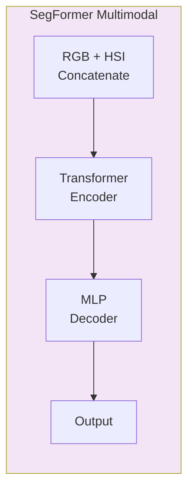
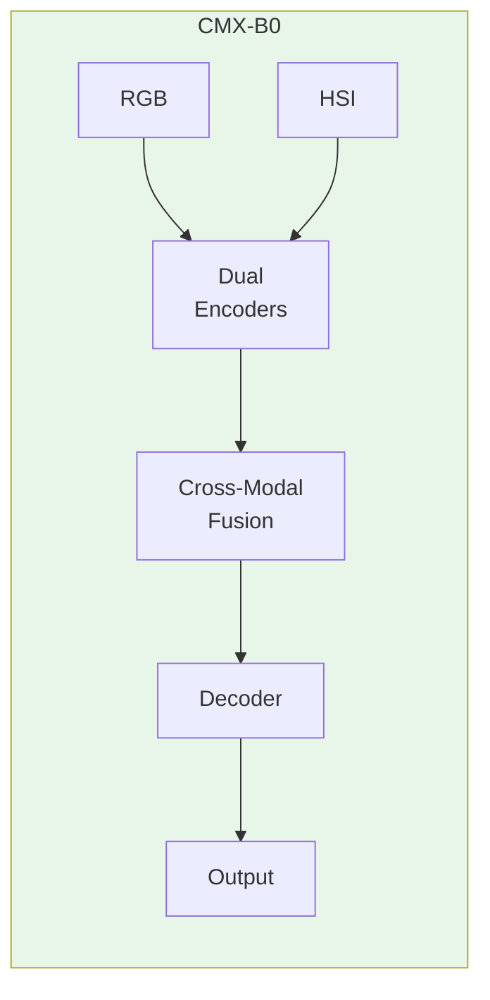
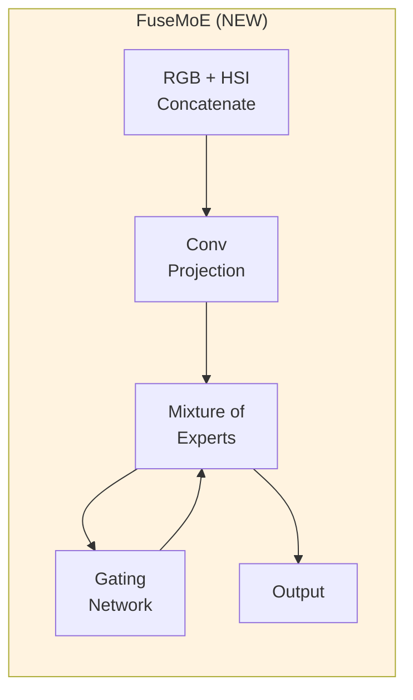
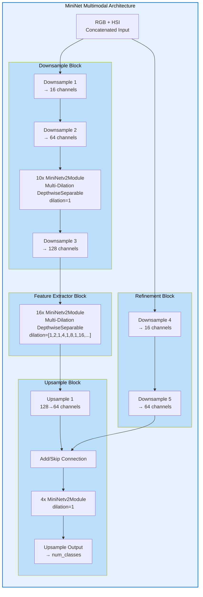
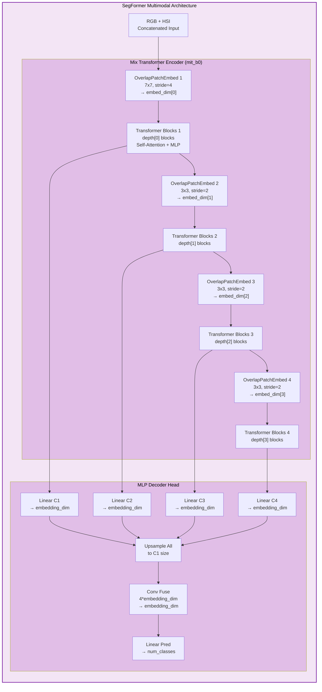
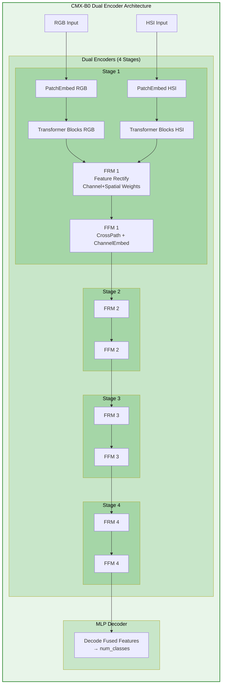
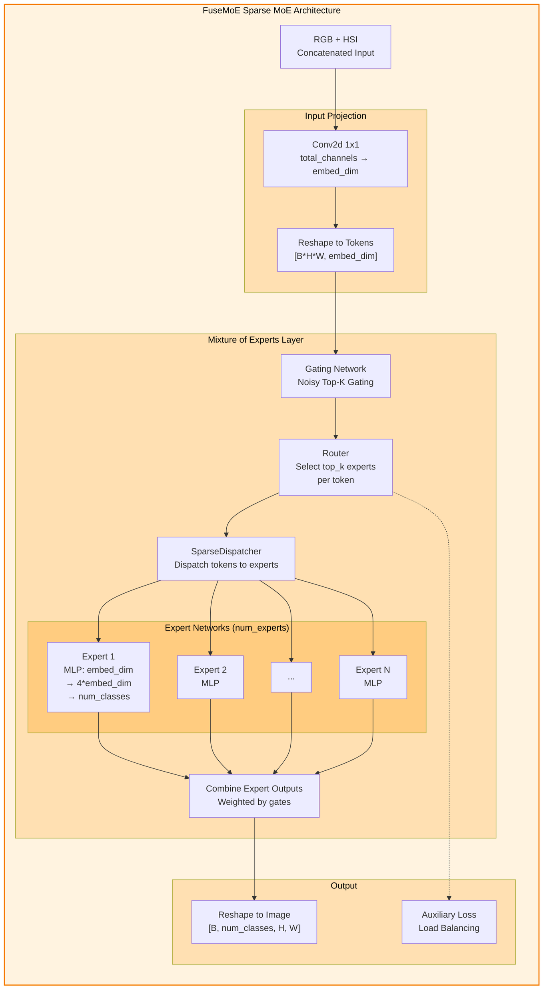

# Overview
## MiniNet

```mermaid
graph LR
    subgraph MiniNet["MiniNet Multimodal"]
        M1["RGB + HSI<br/>Concatenate"]
        M2["Shared CNN<br/>Encoder"]
        M3["Decoder"]
        M4["Output"]
        M1 --> M2 --> M3 --> M4
    end

    style MiniNet fill:#e3f2fd
```
## SegFormer

```mermaid
graph LR
    subgraph SegFormer["SegFormer Multimodal"]
        S1["RGB + HSI<br/>Concatenate"]
        S2["Transformer<br/>Encoder"]
        S3["MLP<br/>Decoder"]
        S4["Output"]
        S1 --> S2 --> S3 --> S4
    end

    style SegFormer fill:#f3e5f5
```
## CMX-B0

```mermaid
graph LR
    subgraph CMX["CMX-B0"]
        C1["RGB"]
        C2["HSI"]
        C3["Dual<br/>Encoders"]
        C4["Cross-Modal<br/>Fusion"]
        C5["Decoder"]
        C6["Output"]
        C1 --> C3
        C2 --> C3
        C3 --> C4 --> C5 --> C6
    end

    style CMX fill:#e8f5e9
```
## FuseMoE

```mermaid
graph LR
    subgraph FuseMoE["FuseMoE (NEW)"]
        F1["RGB + HSI<br/>Concatenate"]
        F2["Conv<br/>Projection"]
        F3["Mixture of<br/>Experts"]
        F4["Gating<br/>Network"]
        F5["Output"]
        F1 --> F2 --> F3
        F3 --> F4
        F4 --> F3
        F3 --> F5
    end

    style FuseMoE fill:#fff3e0
```

# Detail

## MiniNet

```mermaid
graph TB
    subgraph MiniNet["MiniNet Multimodal Architecture"]
        direction TB
        MN_IN["RGB + HSI<br/>Concatenated Input"]

        subgraph MN_DOWN["Downsample Block"]
            MN_D1["Downsample 1<br/>→ 16 channels"]
            MN_D2["Downsample 2<br/>→ 64 channels"]
            MN_M1_10["10x MiniNetv2Module<br/>Multi-Dilation DepthwiseSeparable<br/>dilation=1"]
            MN_D3["Downsample 3<br/>→ 128 channels"]
        end

        subgraph MN_FEAT["Feature Extractor Block"]
            MN_M11_26["16x MiniNetv2Module<br/>Multi-Dilation DepthwiseSeparable<br/>dilation=[1,2,1,4,1,8,1,16,...]"]
        end

        subgraph MN_REF["Refinement Block"]
            MN_D4["Downsample 4<br/>→ 16 channels"]
            MN_D5["Downsample 5<br/>→ 64 channels"]
        end

        subgraph MN_UP["Upsample Block"]
            MN_UP1["Upsample 1<br/>128→64 channels"]
            MN_ADD["Add/Skip Connection"]
            MN_M27_30["4x MiniNetv2Module<br/>dilation=1"]
            MN_OUT["Upsample Output<br/>→ num_classes"]
        end

        MN_IN --> MN_D1 --> MN_D2 --> MN_M1_10 --> MN_D3
        MN_D3 --> MN_M11_26
        MN_IN --> MN_D4 --> MN_D5
        MN_M11_26 --> MN_UP1
        MN_UP1 --> MN_ADD
        MN_D5 --> MN_ADD
        MN_ADD --> MN_M27_30 --> MN_OUT
    end

    style MiniNet fill:#e3f2fd,stroke:#1976d2,stroke-width:2px,color:#000
    style MN_DOWN fill:#bbdefb,color:#000
    style MN_FEAT fill:#bbdefb,color:#000
    style MN_REF fill:#bbdefb,color:#000
    style MN_UP fill:#bbdefb,color:#000
```

## SegFormer

```mermaid
graph TB
    subgraph SegFormer["SegFormer Multimodal Architecture"]
        direction TB
        SF_IN["RGB + HSI<br/>Concatenated Input"]

        subgraph SF_ENC["Mix Transformer Encoder (mit_b0)"]
            SF_PE1["OverlapPatchEmbed 1<br/>7x7, stride=4<br/>→ embed_dim[0]"]
            SF_B1["Transformer Blocks 1<br/>depth[0] blocks<br/>Self-Attention + MLP"]
            SF_PE2["OverlapPatchEmbed 2<br/>3x3, stride=2<br/>→ embed_dim[1]"]
            SF_B2["Transformer Blocks 2<br/>depth[1] blocks"]
            SF_PE3["OverlapPatchEmbed 3<br/>3x3, stride=2<br/>→ embed_dim[2]"]
            SF_B3["Transformer Blocks 3<br/>depth[2] blocks"]
            SF_PE4["OverlapPatchEmbed 4<br/>3x3, stride=2<br/>→ embed_dim[3]"]
            SF_B4["Transformer Blocks 4<br/>depth[3] blocks"]
        end

        subgraph SF_DEC["MLP Decoder Head"]
            SF_L1["Linear C1<br/>→ embedding_dim"]
            SF_L2["Linear C2<br/>→ embedding_dim"]
            SF_L3["Linear C3<br/>→ embedding_dim"]
            SF_L4["Linear C4<br/>→ embedding_dim"]
            SF_UP["Upsample All<br/>to C1 size"]
            SF_FUSE["Conv Fuse<br/>4*embedding_dim<br/>→ embedding_dim"]
            SF_PRED["Linear Pred<br/>→ num_classes"]
        end

        SF_IN --> SF_PE1 --> SF_B1 --> SF_PE2 --> SF_B2
        SF_B2 --> SF_PE3 --> SF_B3 --> SF_PE4 --> SF_B4
        SF_B1 --> SF_L1
        SF_B2 --> SF_L2
        SF_B3 --> SF_L3
        SF_B4 --> SF_L4
        SF_L1 & SF_L2 & SF_L3 & SF_L4 --> SF_UP --> SF_FUSE --> SF_PRED
    end

    style SegFormer fill:#f3e5f5,stroke:#7b1fa2,stroke-width:2px,color:#000
    style SF_ENC fill:#e1bee7,color:#000
    style SF_DEC fill:#e1bee7,color:#000
```

## CMX-B0

```mermaid
graph TB
    subgraph CMX["CMX-B0 Dual Encoder Architecture"]
        direction TB
        CMX_RGB["RGB Input"]
        CMX_HSI["HSI Input"]

        subgraph CMX_ENC["Dual Encoders (4 Stages)"]
            direction LR
            subgraph CMX_S1["Stage 1"]
                CMX_PE1_R["PatchEmbed RGB"]
                CMX_PE1_H["PatchEmbed HSI"]
                CMX_B1_R["Transformer Blocks RGB"]
                CMX_B1_H["Transformer Blocks HSI"]
                CMX_FRM1["FRM 1<br/>Feature Rectify<br/>Channel+Spatial Weights"]
                CMX_FFM1["FFM 1<br/>CrossPath + ChannelEmbed"]
            end

            subgraph CMX_S2["Stage 2"]
                CMX_FRM2["FRM 2"]
                CMX_FFM2["FFM 2"]
            end

            subgraph CMX_S3["Stage 3"]
                CMX_FRM3["FRM 3"]
                CMX_FFM3["FFM 3"]
            end

            subgraph CMX_S4["Stage 4"]
                CMX_FRM4["FRM 4"]
                CMX_FFM4["FFM 4"]
            end
        end

        subgraph CMX_DEC["MLP Decoder"]
            CMX_DEC_OUT["Decode Fused Features<br/>→ num_classes"]
        end

        CMX_RGB --> CMX_PE1_R --> CMX_B1_R
        CMX_HSI --> CMX_PE1_H --> CMX_B1_H
        CMX_B1_R & CMX_B1_H --> CMX_FRM1
        CMX_FRM1 --> CMX_FFM1
        CMX_FFM1 --> CMX_FRM2 --> CMX_FFM2
        CMX_FFM2 --> CMX_FRM3 --> CMX_FFM3
        CMX_FFM3 --> CMX_FRM4 --> CMX_FFM4
        CMX_FFM4 --> CMX_DEC_OUT
    end

    style CMX fill:#e8f5e9,stroke:#388e3c,stroke-width:2px,color:#000
    style CMX_ENC fill:#c8e6c9,color:#000
    style CMX_S1 fill:#a5d6a7,color:#000
    style CMX_S2 fill:#a5d6a7,color:#000
    style CMX_S3 fill:#a5d6a7,color:#000
    style CMX_S4 fill:#a5d6a7,color:#000
    style CMX_DEC fill:#c8e6c9,color:#000
```

## FuseMoE

```mermaid
graph TB
    subgraph FuseMoE["FuseMoE Sparse MoE Architecture"]
        direction TB
        FM_IN["RGB + HSI<br/>Concatenated Input"]

        subgraph FM_PROJ["Input Projection"]
            FM_CONV["Conv2d 1x1<br/>total_channels → embed_dim"]
            FM_RESHAPE["Reshape to Tokens<br/>[B*H*W, embed_dim]"]
        end

        subgraph FM_MOE["Mixture of Experts Layer"]
            direction TB
            FM_GATE["Gating Network<br/>Noisy Top-K Gating"]
            FM_ROUTER["Router<br/>Select top_k experts<br/>per token"]

            subgraph FM_EXP["Expert Networks (num_experts)"]
                FM_E1["Expert 1<br/>MLP: embed_dim<br/>→ 4*embed_dim<br/>→ num_classes"]
                FM_E2["Expert 2<br/>MLP"]
                FM_E3["..."]
                FM_EN["Expert N<br/>MLP"]
            end

            FM_DISP["SparseDispatcher<br/>Dispatch tokens to experts"]
            FM_COMB["Combine Expert Outputs<br/>Weighted by gates"]
        end

        subgraph FM_OUT["Output"]
            FM_RESHAPE_OUT["Reshape to Image<br/>[B, num_classes, H, W]"]
            FM_AUX["Auxiliary Loss<br/>Load Balancing"]
        end

        FM_IN --> FM_CONV --> FM_RESHAPE
        FM_RESHAPE --> FM_GATE --> FM_ROUTER
        FM_ROUTER --> FM_DISP
        FM_DISP --> FM_E1 & FM_E2 & FM_E3 & FM_EN
        FM_E1 & FM_E2 & FM_E3 & FM_EN --> FM_COMB
        FM_COMB --> FM_RESHAPE_OUT
        FM_ROUTER -.-> FM_AUX
    end

    style FuseMoE fill:#fff3e0,stroke:#f57c00,stroke-width:2px,color:#000
    style FM_PROJ fill:#ffe0b2,color:#000
    style FM_MOE fill:#ffe0b2,color:#000
    style FM_EXP fill:#ffcc80,color:#000
    style FM_OUT fill:#ffe0b2,color:#000
```